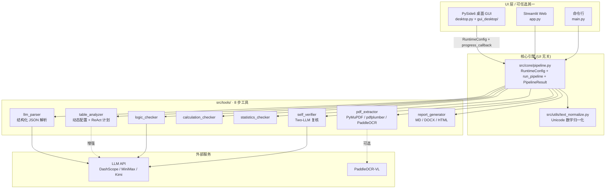
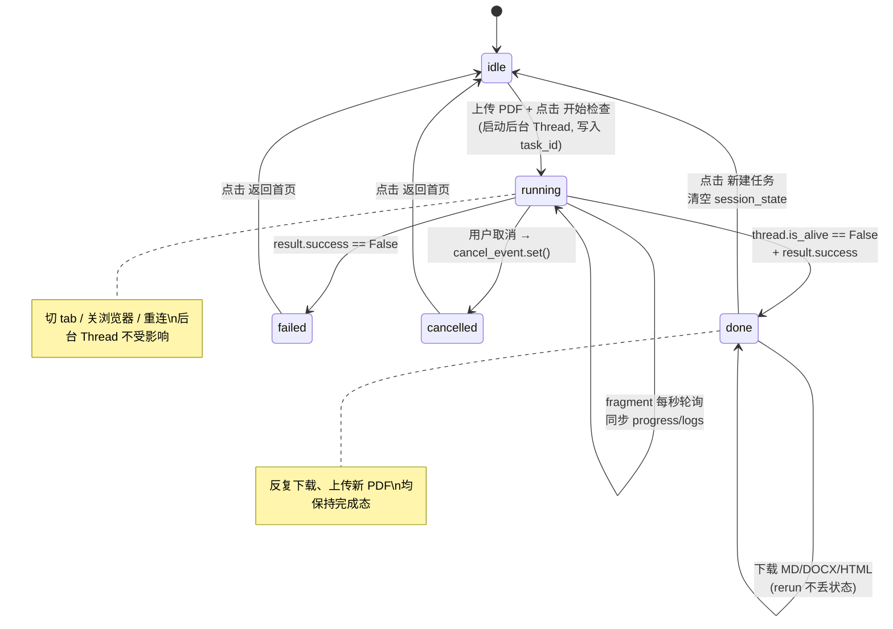
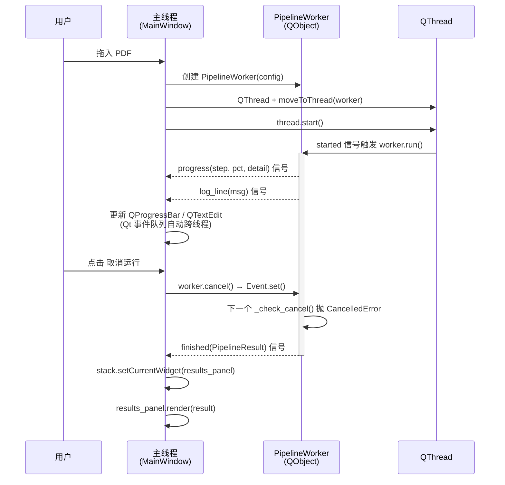

# 建筑变形监测报告核验台 v2

[](https://www.python.org/)
[](https://doc.qt.io/qtforpython-6/)
[](https://streamlit.io/)
[](LICENSE)
[](tests/)

> 基于 LLM + 规则引擎的建筑变形监测报告自动审核系统。一份 PDF 进，一份带问题清单的检查报告出。

---

## 这是什么

建筑变形监测报告（基坑、桥梁、隧道、深基坑支护等）由专业监测公司出具，**累计变化量、变化速率、最大/最小统计、安全状态判定**这些字段必须与原始测值自洽。但每家公司格式各异，单位混杂（mm / m / kN）、列序不同、初始值含义也不一样。

本工具做的事：抽取 PDF → 让 LLM 理解每张数据表的语义 → 用规则引擎按表自适应地校验所有计算/统计/逻辑字段 → 由第二个 LLM 复核可疑错误（Two-LLM 误报治理） → 输出带证据的 Markdown / Word / HTML 报告。

适用对象：监测单位自查、第三方复核工程师、监理与建管单位。

---

## 三种使用方式

| 入口 | 适合谁 | 启动命令 | 特点 |
|------|--------|----------|------|
| **桌面 GUI**（推荐） | 工程师日常审核，**长任务最稳** | `python desktop.py` | PySide6 原生窗口、QThread 后台、24 分钟任务不卡 UI |
| **Streamlit Web** | 团队共享部署、远程访问 | `streamlit run app.py` | 浏览器即开即用、tab 切换/下载不丢状态（v2 修复） |
| **CLI** | 批处理、CI、脚本回归 | `python main.py <file.pdf>` | 无依赖 GUI、可被任意调度器调用 |

三个入口共享同一个核心引擎（`src/core/pipeline.py`），结果完全一致。

> **截图占位**
> - `docs/screenshots/desktop_running.png` — 桌面版运行态（8 步进度条 + 实时日志）
> - `docs/screenshots/desktop_done.png` — 桌面版完成态（8 个结果 Tab）
> - `docs/screenshots/streamlit_done.png` — Streamlit 完成态

---

## 架构总览

三层 UI 共用同一份核心引擎，引擎本身不依赖任何 UI 框架，可独立测试与嵌入其它系统。



**关键设计**

- 核心引擎只暴露三样东西：`RuntimeConfig`（输入）、`run_pipeline()`（执行）、`PipelineResult`（输出）。
- 进度通过回调 `(step_id, label, percent, detail)` 上报，由 UI 自行决定如何渲染。
- 支持 `cancel_event` 协作式取消，单步失败可降级而非整体中断。

---

## 8 步流水线

```mermaid
flowchart LR
    PDF[("PDF<br/>报告")] --> S1
    S1["Step 1<br/>PDF 提取<br/>PyMuPDF/pdfplumber/OCR"] --> S2
    S2["Step 2<br/>LLM 结构化解析<br/>文本 → JSON"] --> S25
    S25["Step 2.5<br/>分析计划<br/>ReAct"] --> S3
    S3["Step 3<br/>计算验证<br/>累计变化/速率"] --> S4
    S4["Step 4<br/>统计验证<br/>最大/最小"] --> S5
    S5["Step 5<br/>逻辑检查<br/>安全状态/汇总一致"] --> S6
    S6["Step 6<br/>AI 自验证<br/>error 二次确认"] --> S7
    S7["Step 7<br/>AI 最终审核<br/>整体复读"] --> S8
    S8["Step 8<br/>报告生成<br/>MD/DOCX/HTML"] --> OUT[("检查报告")]

    style S1 fill:#e0f2fe,stroke:#0284c7
    style S2 fill:#fef3c7,stroke:#d97706
    style S25 fill:#fef3c7,stroke:#d97706
    style S6 fill:#fef3c7,stroke:#d97706
    style S7 fill:#fef3c7,stroke:#d97706
    style OUT fill:#dcfce7,stroke:#16a34a
```



> 黄色节点调用 LLM；蓝色节点可选调用 OCR；其余为纯 Python 规则。

| Step | 名称 | 耗时 | 说明 |
|------|------|------|------|
| 1 | PDF 提取 | 5–30 s | PyMuPDF 文本层先判，质量不足回退 pdfplumber 再回退 PaddleOCR-VL。OCR 结果按 PDF SHA256 + profile 指纹缓存。同时扫描 OCR 缓存目录识别损毁（连续 200+ 同字符 blob、行重复 50+ 次）。 |
| 2 | LLM 结构化解析 | 60–180 s | 多策略分块（页 / 表 / 字符），每块单独发 LLM，合并为统一 JSON。响应按 SHA256(messages+params) 磁盘缓存（temperature ≤ 0.3 时），开发迭代可达 **9× 速度提升**。 |
| 2.5 | 分析计划 (ReAct) | <1 s | 纯 Python，把对每张表的字段识别、单位推断、容差选择、将要执行的验证规则**显式输出**，供用户审查 AI 理解过程。 |
| 3 | 计算验证 | <1 s | 累计变化 = 本次 − 初始；变化速率 = 本次变化 / 间隔天数。容差按表动态调整。**符号一致性检查**：sign(current − initial) 应与 sign(cumulative) 同号（量级悬殊 >10× 时跳过避免误报）。**单期变化幅度异常**：测点本次变化 > 3× 中位数（离群）或 \|本次\| > 3 × \|累计\|（不协调）。 |
| 4 | 统计验证 | <1 s | 正/负方向最大、最大速率、最大/最小内力；深层位移表豁免跨表引用。**真实最大速率掩盖检测**：报告值 < 30% × max(\|rate\|) 时告警（避免"行业口径"掩盖关键风险）。 |
| 5 | 逻辑检查 | 30–60 s | 安全状态匹配（LLM 语义） + 简报与分表汇总一致性。**接近预警值告警**：累计 ≥ 80% 预警值 + 状态标"正常" → 建议加密观测。 |
| 6 | AI 自验证 | 30–120 s | 仅对 `error` 级问题发起 Two-LLM 复核：confirm / downgrade / dismiss，可关闭。 |
| 7 | AI 最终审核 | 30–90 s | 把初步报告 + 原文交给 LLM 整体复读，可关闭。 |
| 8 | 报告生成 | <1 s | 输出标准化 Markdown，可一键转 Word / HTML。 |

**总耗时**：完整流水线 3–8 分钟；跳过 Step 6 + 7 后通常 60–120 秒；
**LLM 响应缓存**激活后重跑同一 PDF 可降至 20–40 秒。

---

## 快速开始

### 环境要求

- Python **3.10+**
- Windows / macOS / Linux
- LLM API Key（DashScope / MiniMax 等任一 OpenAI 兼容端点）
- 可选：PaddleOCR API Token（仅扫描件 / 复杂版式需要）

### 安装

```bash
git clone https://github.com/gaaiyun/building-deformation-checker.git
cd building-deformation-checker

# 通用依赖
pip install -r requirements.txt

# 文本层快速路由（推荐）
pip install pymupdf
```

`requirements.txt` 当前内容：

```
openai>=1.0.0        # LLM 调用（OpenAI 兼容协议）
pdfplumber>=0.11.0   # 文字版 PDF 解析
requests>=2.31.0     # PaddleOCR API 调用
streamlit>=1.30.0    # Streamlit Web UI
PySide6>=6.5.0       # 桌面 GUI
python-docx>=1.0.0   # Word 导出
markdown>=3.5.0      # Markdown → HTML
keyring>=25.0.0      # 桌面版敏感配置存储
pyinstaller>=6.0.0   # 桌面版 .exe 打包
```

### 三种启动方式

**1) 桌面 GUI（推荐）**

```bash
python desktop.py
```

拖入 PDF 即跑；首次启动会提示填写 API Key，配置自动持久化到 `~/AppData/.../settings.json`（Windows）。

**打包桌面版**

```powershell
# 生成 dist/BuildingDeformationChecker.exe
powershell -ExecutionPolicy Bypass -File scripts/build_desktop.ps1

# 如需生成 MSI，先安装 .NET 8 SDK + WiX 4，再加 -BuildMsi
dotnet tool install --tool-path G:\dev-cache\dotnet-tools wix --version 4.0.6
powershell -ExecutionPolicy Bypass -File scripts/build_desktop.ps1 -BuildMsi -Version 2.1.0 -WixToolPath G:\dev-cache\dotnet-tools\wix.exe
```

安装包不内置任何 API Key。交付给甲方/复核员后，由对方在桌面版左侧配置面板自行输入 OpenAI 兼容 `API Key`、`Base URL`、模型名和 PaddleOCR Token；敏感字段保存到系统 keyring，不写入仓库或安装包。

**2) Streamlit Web**

```bash
streamlit run app.py
```

浏览器打开 `http://localhost:8501`，侧边栏填配置，主界面上传 PDF。

**3) CLI**

```bash
# 默认：pdfplumber 优先，必要时回退 OCR
python main.py "监测报告.pdf"

# 扫描件：强制走 OCR
python main.py "扫描件.pdf" --ocr

# 提速：跳过 Step 6 + 7
python main.py "报告.pdf" --no-ai-review --no-self-verify

# 切换 LLM 模型
python main.py "报告.pdf" --model MiniMax-M2.7-highspeed -o output/my_check.md
```

---

## 配置

### API Key 从哪里来

| 服务 | 注册入口 | 说明 |
|------|----------|------|
| **DashScope (阿里云)** | https://dashscope.aliyuncs.com/ | 默认 Base URL，支持 `qwen3.5-plus` |
| **MiniMax** | https://api.minimaxi.com/ | 用 `MiniMax-M2.7-highspeed` 提速 |
| **DeepSeek** | https://api.deepseek.com | OpenAI 兼容端点，当前批量回归使用 `deepseek-v4-flash` |
| **PaddleOCR-VL** | https://aistudio.baidu.com/ | 仅扫描件/复杂版式时需要 |

### 三种配置注入方式（优先级从高到低）

**1) GUI 侧边栏 / Streamlit Sidebar**

最简单。桌面版填一次自动保存；Streamlit 每次会话生效。

**2) 环境变量**

```bash
# PowerShell (Windows)
$env:LLM_API_KEY = "sk-..."
$env:LLM_BASE_URL = "https://coding.dashscope.aliyuncs.com/v1"
$env:LLM_MODEL = "qwen3.5-plus"
$env:PADDLE_OCR_TOKEN = "..."           # 可选
$env:PADDLE_OCR_MODEL = "PaddleOCR-VL-1.6"

# bash / zsh
export LLM_API_KEY="sk-..."
export LLM_MODEL="qwen3.5-plus"
export PADDLE_OCR_MODEL="PaddleOCR-VL-1.6"
```

**3) 桌面版 settings.json + 系统 keyring**

桌面版分**两层**存储用户配置：

- **敏感字段**（`llm_api_key`、`paddle_ocr_token`）→ 系统 keyring（Windows Credential Manager / macOS Keychain / Linux Secret Service），**绝不明文落盘**。
- **非敏感字段**（模型名、URL、超时、UI 偏好）→ `~/AppData/Roaming/BuildingDeformationChecker/settings.json`，纯 JSON，可直接编辑或团队共享。

安装系统 keyring 后端（首次使用前）：

```bash
pip install keyring
```

如果系统不支持 keyring（少数 headless Linux），settings_store 会自动回退到 JSON 存储并打印 warning。

迁移 v1 旧配置：v1 把 API key 也写在 JSON 里；v2 启动时自动读出并迁移到 keyring，旧 JSON 中的明文密钥下次保存时会被清除。

### 常用 RuntimeConfig 字段

直接调用核心引擎时：

```python
from src.core import RuntimeConfig, run_pipeline

cfg = RuntimeConfig(
    pdf_path="report.pdf",
    llm_api_key="sk-...",
    llm_model="qwen3.5-plus",
    paddle_ocr_token="",          # 留空则禁用 OCR
    use_ocr=False,                # True = 强制优先 OCR
    auto_fallback=True,           # 文本层不足时自动回退
    skip_self_verify=False,       # 跳过 Step 6
    skip_ai_review=False,         # 跳过 Step 7
    output_dir="output",
)

result = run_pipeline(cfg, progress_callback=lambda *a: print(a))
print(result.final_md)
```

---

## v2 修复了什么：Streamlit 状态丢失 Bug

v1 的 `app.py` 全文 1300 行**完全没用 `st.session_state`**，导致三个典型 bug：

| 现象 | 根因 |
|------|------|
| 切换浏览器 tab，回来发现进度停了 | Streamlit WebSocket 重连触发 full rerun，`ScriptRunner` 线程被取消 |
| 下载 Markdown 后想下 Word，按钮消失 | 所有结果存在 `if st.button` 块内的局部变量里，rerun 后丢失 |
| 24 分钟的长任务被杀 | 整个流水线跑在主脚本线程，任何 rerun 都会终止 |

**v2 的修复思路**：

1. 把流水线塞进 `threading.Thread` 后台跑，线程句柄存模块级 dict（活在 rerun 之间）。
2. 所有进度、日志、结果一律走 `st.session_state`，用 UUID 跟踪任务。
3. 用 `@st.fragment(run_every=1.0)` 每秒轮询后台状态，无需用户操作。
4. 完成后所有产物保留在 `st.session_state.result`，下载按钮触发的 rerun 不会丢。



桌面版（PySide6）不存在 Streamlit 的 rerun 问题，但仍采用同样的"长任务走后台线程"模式：



**关键点**：信号槽通过 Qt 事件队列跨线程投递，主 UI 线程不会被任何后台调用阻塞，最小化窗口 / 调整大小 / 切换桌面都不会影响后台任务。

---

## 安全设计

- **API Key 不落盘**：所有敏感凭证存系统 keyring，settings.json 永远不含明文 sk-/token 字符串（详见上节）。
- **配置并发安全**：`RuntimeConfig.to_app_globals()` 用 `threading.RLock` 串行化，多个流水线实例并发跑不会互相覆盖配置。
- **输入校验前置**：流水线先校验 PDF 文件存在再同步全局配置，避免污染 `src.config` 后才报错。
- **取消事件协作式**：`cancel_event` 在每步开始时检查，长任务可秒级响应取消，不会泄露未完成的 LLM 调用。
- **OCR 调试目录可关**：默认开启 PaddleOCR 缓存以加速重跑，但调试目录会保存 OCR 原始/清洗中间产物，敏感项目应在 `~/.../settings.json` 关闭。

---

## 测试与质量

```bash
# 跑全部 315 个测试（当前基线：313 passed, 2 skipped）
python -m pytest tests/ -v

# 跑单个模块
python -m pytest tests/test_text_normalize.py -v

# 快速冒烟（无需 API key，用缓存 OCR + 内置样本）
python smoke_test_v2.py
```

`tests/` 目录覆盖（当前 `315 collected / 313 passed / 2 skipped`，约 5 秒跑完）：

| 文件 | 用例数 | 重点覆盖 |
|------|-------|----------|
| `test_text_normalize.py` | 27 | U+2212 / 全角数字 / 千分位 / 中文单位前后缀 / 科学记数 |
| `test_pipeline.py` | 25 | RuntimeConfig 默认值/同步、PipelineResult 派生属性、CancelledError、run_pipeline 异常路径 |
| `test_export_formats.py` | 18 | DOCX 字节流/ZIP 签名/Microsoft YaHei 字体、HTML doctype/lang/中文项目名/print 媒体样式 |
| `test_settings_store.py` | 17 | keyring 隔离、JSON 损坏容错、env var 回退、敏感字段不落 JSON |
| `test_worker.py` | 9 | PipelineWorker.cancel()、SignalLogHandler、make_worker_thread 生命周期 |
| `test_desktop_main_window.py` | 6 | PySide6 offscreen 实例化、专业主题样式、配置面板到 RuntimeConfig、三态主窗、结果面板渲染 |
| `test_packaging_assets.py` | 2 | 桌面打包脚本、WiX MSI 模板、密钥不内置、per-user 安装范围 |
| `test_pdf_extractor.py` | 6 | OCR/文本层路由、清洗、缓存命中 |
| `test_llm_parser.py` | 4 | JSON 提取容错、分块策略、`_extract_json_from_response` |
| `test_calculation_checker.py` | 9 | 单位换算、间隔仲裁、跨期连续性、深层位移 abs 比较 |
| `test_cross_period_continuity.py` | 13 | 多期累计递推、同日 AM/PM 跳过、反向符号口径 |
| `test_statistics_checker.py` | 6 | 正/负方向最大、跨表引用、宽表本次变化/当前累计口径 |
| `test_logic_and_self_verifier.py` | 7 | 安全状态语义匹配、汇总口径 warning、Two-LLM 复核流程 |
| `test_table_recognition_fixes.py` | 8 | 异常表识别、单位推断回归 |
| `test_step78_timeout_fix.py` | 9 | Step 6 / Step 7 LLM 超时与降级 |
| `test_report_generator.py` | 1 | Markdown 渲染快照 |

仓库还附带 5 份样本 PDF + OCR 缓存（`output/*_ocr_debug/`），可在无 API key 情况下做离线回归。

### 真实 PDF 回归基线

当前批量回归使用 OpenAI 兼容接口 `LLM_BASE_URL=https://api.deepseek.com`、`LLM_MODEL=deepseek-v4-flash`，OCR 模型环境变量为 `PaddleOCR-VL-1.6`；`--quick` 会跳过 Step 6/7 以便稳定比较规则层结果。

模板 PDF（`python baseline/run_tool_tests.py --quick`）：

| PDF | error | warning | 说明 |
|-----|------:|--------:|------|
| 质安模板-错误版.pdf | 18 | 5 | 人工错误可检出 |
| 质安模板-正确版.pdf | 0 | 3 | 正确版无 error |
| 深工勘模板-错误版.pdf | 8 | 10 | 部分宽表/汇总口径降为 warning 复核 |
| 深工勘模板-正确版.pdf | 0 | 29 | 正确版无 error |
| 展誉模板-错误版.pdf | 14 | 17 | 跨期累计递推错误可检出 |
| 展誉模板-正确版.pdf | 0 | 21 | 正确版无 error |

原始 PDF（`python baseline/run_original_pdfs.py --quick`）：

| 样本 | error | warning | 备注 |
|------|------:|--------:|------|
| 鱼珠乐天 | 0 | 20 | proximity/anomaly 以 warning 呈现 |
| 监测报告测试 | 0 | 22 | 人工复核提示保留为 warning |
| 红土创新广场 | 0 | 0 | 干净通过 |
| 恒大中心 | 0 | 14 | 大 PDF 汇总口径提示 |
| 设计说明 | 0 | 1 | 负样本：无可计算监测表 |

入口 smoke：

| 入口 | 验证方式 | 结果 |
|------|----------|------|
| CLI | `python main.py missing.pdf` | 正常返回“文件不存在”错误路径，无 traceback |
| Streamlit | 本地启动 `streamlit run app.py --server.headless=true --server.port=8765` 并访问 `http://127.0.0.1:8765` | HTTP 200 |
| 桌面端 UI | `tests/test_desktop_main_window.py` 在 `QT_QPA_PLATFORM=offscreen` 下实例化主窗、专业主题、配置和结果面板 | 6 passed |
| 桌面端 EXE | PyInstaller 构建 `dist/BuildingDeformationChecker.exe` 并启动 8 秒 | `EXE_SMOKE_OK` |
| 桌面端 MSI | WiX 4 构建 `dist/BuildingDeformationChecker-2.1.0.msi`，静默安装、启动安装后 EXE、静默卸载 | install/uninstall exit 0 |

---

## 项目结构

```
building-deformation-checker/
├── desktop.py                       # 桌面版入口
├── main.py                          # CLI 入口
├── app.py                           # Streamlit Web UI (v2 重写)
├── app_v1_legacy.py                 # v1 旧 UI，保留参照
├── smoke_test_v2.py                 # 冒烟脚本
├── requirements.txt
├── LICENSE                          # MIT
│
├── src/
│   ├── core/                        # 【v2 新增】UI 无关核心引擎
│   │   ├── pipeline.py              #   - RuntimeConfig
│   │   │                            #   - PipelineResult
│   │   │                            #   - run_pipeline()
│   │   └── __init__.py
│   ├── config.py                    # 全局配置（兼容层）
│   ├── models/
│   │   └── data_models.py           # MonitoringReport / CheckIssue 等数据类
│   ├── utils/
│   │   ├── text_normalize.py        # 【v2 新增】Unicode 数字归一化
│   │   └── llm_client.py
│   └── tools/
│       ├── pdf_extractor.py         # PyMuPDF/pdfplumber/PaddleOCR-VL 路由
│       ├── llm_parser.py            # LLM 结构化解析
│       ├── table_analyzer.py        # 动态配置 + ReAct 计划
│       ├── calculation_checker.py
│       ├── statistics_checker.py
│       ├── logic_checker.py
│       ├── self_verifier.py         # Step 6 Two-LLM
│       ├── extraction_quality.py    # 提取质量诊断
│       ├── report_generator.py
│       └── export_formats.py        # DOCX / HTML 转换
│
├── gui_desktop/                     # 【v2 新增】PySide6 桌面 GUI
│   ├── main_window.py               #   - IdlePanel / RunningPanel / ResultsPanel
│   ├── worker.py                    #   - QThread + Signal worker
│   └── settings_store.py            #   - 配置持久化
│
├── tests/                           # 315 个 pytest 用例（313 passed, 2 skipped）
├── docs/
│   ├── specs/
│   │   └── 2026-05-16-v2-redesign-design.md
│   ├── 异构PDF表格核对流程设计.md
│   └── 老板汇报_提取与误报治理设计说明.md
│
└── output/                          # 检查报告输出（git ignore）
    └── *_ocr_debug/                 # OCR 调试与缓存目录
```

---

## 输出报告样例

`output/<pdf_stem>_检查报告.md` 头部片段：

```markdown
# 建筑变形监测报告检查报告

**生成时间**: 2026-05-13 01:10:37
**项目名称**: 智能科技创新中心
**监测单位**: 广东变形检测工程技术有限公司
**报告编号**: 监测2023011-017
**监测日期**: 2024-03-26

## 检查结果统计

| 类别 | 数量 |
|------|------|
| 错误 | 0    |
| 警告 | 4    |
| 提示 | 11   |
| 合计 | 15   |

> 疑似提取问题 8 条，建议结合原文人工复核。

## 数据提取摘要

- 提取方式: pdfplumber (pdfplumber)
- 监测数据表: 12 张
- 文本压缩率: 100.00%
- OCR 调试目录: `output/监测报告检查（测试）_ocr_debug`

## 计算验证结果
...
```

完整样例见 `output/batch_fast_20260513/` 目录下的四份 Markdown。

---

## 已知限制与路线图

**当前限制**

- 单文件场景为主，未做多文件批处理 UI（CLI 可脚本化批量）。
- 不做数据库持久化，所有结果落盘为文件。
- LLM 调用未本地化，离线场景仅可跑规则层（Step 1/3/4/8）。
- 桌面 GUI 已有 `build_desktop.spec`、`scripts/build_desktop.ps1` 和 WiX MSI 模板；源码方式、配置面板、专业主题和结果面板已通过 offscreen 自动化测试；本机已完成 `.exe` 启动 smoke、`.msi` 静默安装/启动/卸载 smoke。

**路线图（按优先级）**

- [x] PyInstaller 打包 `.exe` 脚本，支持零依赖分发
- [x] WiX `.msi` 安装包模板与 per-user 安装验证
- [ ] PaddleOCR-VL 本地推理选项（去 API 依赖）
- [ ] 多文件并发批处理面板（桌面版）
- [ ] 内嵌 PDF 预览定位异常字段（QPdfView 已在主窗框架内）
- [ ] FastAPI 服务封装，供其它系统集成

---

## 致谢与许可

**技术栈**

- LLM 路由：`openai` SDK + DashScope / MiniMax 等 OpenAI 兼容端点
- PDF：`pdfplumber` / `PyMuPDF` / PaddleOCR-VL
- 桌面 GUI：`PySide6` 6.5+
- Web UI：`streamlit` 1.30+
- 文档导出：`python-docx` + `markdown`

**领域参照**

- GB 50497-2019《建筑基坑工程监测技术标准》
- JGJ 8-2016《建筑变形测量规范》

**许可**

MIT License — 见 [LICENSE](LICENSE)。欢迎 issue / PR。
