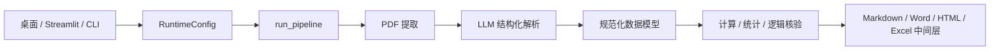

# 开发交接与生产验收手册

更新时间：2026-06-28

本文面向后续开发 Agent、维护工程师和业务复核人员，说明建筑变形监测报告核验工具的真实架构、数据流、字段语义、计算规则、测试纪律和发布流程。实际样本结果、耗时和外部服务状态以 [`实际测试报告.md`](./实际测试报告.md) 为准；业务公式的详细定义以 [`计算核验逻辑说明.md`](./计算核验逻辑说明.md) 为准。

## 1. 唯一主仓库与交付边界

- 唯一主仓库：`G:\github_project_0516\building-deformation-checker`
- 旧工程和历史发布物：`G:\github_project_0516\_archive\building-deformation-checker-pre-production-20260620`
- 真实 PDF/XLSX、API 密钥、OCR 原始结果、运行日志和大体积二进制均不提交 Git。
- `dist/` 为本地发布目录，被 `.gitignore` 排除；GitHub 保存源码、测试、文档和构建脚本。
- 最终模型验收必须使用真实 DeepSeek；`scripts/mock_openai_server.py` 只能做开发期协议烟测，不能作为生产验收证据。

### 1.1 2026-06-28 Claude/Codex 接手快照

- 主仓库仍以 `G:\github_project_0516\building-deformation-checker` 为准；不要从 `C:\Users\gaaiy\Desktop\建筑变形监测Agent` 回拷旧文件。
- 本地交接密钥文件：`G:\github_project_0516\building-deformation-checker\.env`，已被 `.gitignore` 排除，仅供本机 Claude/Codex 复现真实 DeepSeek/PaddleOCR 测试。
- Windows keyring service：`BuildingDeformationChecker`；敏感键名：`llm_api_key`、`paddle_ocr_token`。
- 当前本机发布产物：`dist\BuildingDeformationChecker.exe`、`dist\BuildingDeformationChecker-2.1.11.msi`、`dist\BuildingDeformationChecker.msi`。
- 2026-06-28 当前源码已重建并验证：`pytest` 为 `410 passed, 3 skipped`；Streamlit Playwright 真实 DeepSeek 完成态和四格式下载通过；EXE 直接启动 10 秒未退出；打包后 EXE UIA 可识别标题、品牌、模型、Paddle、选 PDF、保存配置和清密钥控件；MSI 静默安装、安装后启动、静默卸载通过。
- 2026-06-28 真实模型验收：DeepSeek `deepseek-v4-flash` 质安、展誉、深工勘错误/正确六份 Excel 转 PDF 样本默认无缓存通过；三个正确版均 0 error，三个错误版均检出 error。
- 2026-06-28 原生/OCR 验收：恒大中心原生 PDF 当前源码复跑 198 表、0 error；鱼珠乐天强制 PaddleOCR 跑通 `paddle_ocr/table`，11 表、0 error。
- 最新本地证据目录：`output\actual_acceptance_20260628_092402`、`output\actual_acceptance_20260628_zhanyu_error_after_export_fix`、`output\actual_acceptance_20260628_zhanyu_correct_after_export_fix`、`output\actual_acceptance_20260628_shengongkan_pair`、`output\actual_acceptance_20260628_original_hengda`、`output\actual_acceptance_20260628_paddle_yuzhu_forced`、`G:\dev-cache\bdc-ui-qa\real_deepseek_20260628`。这些目录被 `.gitignore` 排除或位于仓库外，不提交 Git。
- 2026-06-28 产物 hash：EXE SHA256 `5BE041F5D7DD6C3B27455F68109DBBED1F4D43C1689E04850613E3D75A0B41F8`；MSI SHA256 `1D6535DAB725166FDB9C64AD5C6D6A22F740394130B63961A59EDAD7FC6B0C62`。

## 2. 三个入口和共享核心

| 入口 | 文件 | 定位 |
|---|---|---|
| 桌面端 | `desktop.py` + `gui_desktop/` | 甲方和工程师日常使用；QThread 后台运行，长任务不阻塞窗口 |
| Web | `app.py` | Streamlit 部署；后台线程注册表保存任务，rerun/下载不丢状态 |
| CLI | `main.py` | 批处理、自动化验收和问题复现 |

三个入口都构造 `src.core.pipeline.RuntimeConfig`，最终进入 `src.core.pipeline.run_pipeline()`。任何模型、OCR、缓存或超时行为变更，都必须同时检查三个入口是否完整传递配置。



## 3. 配置和密钥

### 3.1 默认值

- DeepSeek Base URL：`https://api.deepseek.com`
- 默认模型：`deepseek-v4-flash`
- 可选模型：`deepseek-v4-pro`、`deepseek-chat`、`deepseek-reasoner` 及自定义 OpenAI-compatible 模型 ID
- PaddleOCR：`PaddleOCR-VL-1.6`

### 3.2 存储

- 敏感字段 `llm_api_key`、`paddle_ocr_token` 保存到系统 keyring。
- 非敏感字段保存到 `%APPDATA%\BuildingDeformationChecker\settings.json`。
- 安装包、源码和 `.env.example` 不得包含真实密钥。
- 本机协作交接可临时使用仓库根目录 `.env`，但该文件必须保持 git ignored，并在提交前扫描 tracked 文件不得含真实 key。
- 读取优先级：界面/RuntimeConfig > 环境变量 > keyring/settings 默认值。

### 3.3 代理环境

所有 OpenAI-compatible 客户端必须通过 `src.utils.llm_client.create_openai_client()` 创建。该函数使用 `httpx.Client(trust_env=False)`，避免 Windows 代理或 `NO_PROXY=::1` 导致 `Invalid port ':1'`。业务模块不得直接实例化 `openai.OpenAI`。

## 4. PDF 提取层

实现：`src/tools/pdf_extractor.py`

### 4.1 文本型 PDF

1. 首选 `pdfplumber`。
2. pdfminer 内存/解析异常时回退 PyMuPDF。
3. 每页文本前插入页码标记：`--- 第 N 页 / 共 M 页 ---`。
4. 数字统一经过 `normalize_numeric_text()`，处理 Unicode 负号、全角数字和特殊空格。
5. `return_details=True` 时同时用 `pdfplumber.extract_tables()` 生成 `Pxxx-Txx` 原始候选表；失败只写诊断，不阻断文本提取。
6. 候选表写入 Excel `00A_候选表清单` 和 `00B_候选表单元格`，用于 LLM 前审计。

### 4.2 OCR 路径

- 默认只在文本层质量不足时自动回退。
- 用户可选择“优先 PaddleOCR”或“强制 PaddleOCR”。
- 异步任务使用 `https://paddleocr.aistudio-app.com/api/v2/ocr/jobs`。
- OCR profile 会启用表格合并和页面重构；结果按 PDF 指纹和 profile 指纹缓存。
- 失败必须进入可见错误态，不能静默回退到错误接口或让 UI 闪退。

### 4.3 OCR 清洗

- HTML 表格被转换为 `| cell | cell |` 的行文本。
- 曲线坐标轴、重复图例和高比例数字噪声会被过滤。
- 清洗统计写入 `extraction_diagnostics`，包括页数、原始字符、清洗字符、表格数和异常提示。

## 5. 表格切分和跨页处理

实现：`src/tools/llm_parser.py`

切分优先级：

1. 明确附表标题，如 `附表 1-1-1 ...观测结果表`。
2. `【监测项目】监测数据成果` 类型标题。
3. 页码标记。
4. 字符长度切分并保留重叠。

同一表族的连续续表可以合并；不同监测项必须隔离。结构化表段会保留最近的页码标记，下一页标记不能挂在上一表段末尾。表感知分块的目标是避免一个表被粗暴截断，同时防止超长请求导致模型截断或网络断流。

完整性检查：

- 原文含多个日期时，返回表数不得少于日期数。
- `point_count >= 5` 时，实际测点数不得低于声明数的 80%。
- 失败结果会按 `LLM_PARSE_RESULT_RETRIES` 重新请求。
- 任一 chunk 最终失败，报告必须产生“LLM 分块解析未覆盖全部文本分块”警告，不能伪报完整。

## 6. 规范化数据模型

实现：`src/models/data_models.py`

### 6.1 MonitoringTable

核心字段：监测项目、类别、日期、期次、测孔、声明测点数、单位和验证配置。

来源字段：

- `source_chunk`：LLM 分块编号，1 起始。
- `source_pages`：该表段涉及的原始 PDF 页码。

### 6.2 MeasurementPoint

标准字段：

- `point_id`
- `initial_value`
- `previous_value`
- `current_value`
- `current_change`
- `cumulative_change`
- `change_rate`
- `safety_status`

来源字段：

- `source_chunk`
- `source_page`
- `source_row_text`
- `source_field_map`

`source_field_map` 是 JSON 字符串，记录标准字段与原始表格列号的唯一数值匹配，例如：

```json
{"current_change":2,"cumulative_change":3,"change_rate":4}
```

列号从 1 开始。只有某个标准值在原始行中唯一匹配一个数值单元格时才记录；重复值导致歧义时留空，不制造虚假确定性。来源回链由本地代码完成，不要求 LLM 输出额外字段，因此不会显著增加模型 token。

### 6.3 DeepDisplacementPoint

标准字段：深度、上次累计、本次累计、本次变化、变化速率；同样保存来源分块、页码、原始行和字段列映射。

## 7. 字段语义规则

### 7.1 普通沉降/位移表

- 有明确“初始值”时：`累计变化 = (本次值 - 初始值) × 单位换算`。
- 只有“本次变化/累计变化”时，不得把第一列数值误当初始值。
- 横向多期表拆为多张 `MonitoringTable`，每期重复全部测点并设置独立日期。

### 7.2 首期基准

“报告时间段第一天”不自动等于项目首次监测。只有出现首测/初测/第 1 次等证据，或多数数据支持 `累计≈本次` 时，才执行首期累计基准硬校验。

### 7.3 锚索/支撑轴力

对于明确表头 `本次(kN) / 测值(kN) / 变化速率`：

- `current_change = 本次(kN)`
- `cumulative_change = 测值(kN)`
- `initial_value_reliable = false`
- 禁止用“测值 - 初始值”计算累计力值。

### 7.4 深层位移

- 按深度行保存，不混入普通测点表。
- 本次变化由本次累计与上次累计差值核对。
- 同测孔跨日期检查累计连续性。

### 7.5 汇总表

“监测结果汇总表”“本报告期间最大值”等只能进入 `summary_items/statistics`，不能作为逐点原始表加入 `tables`。

## 8. 计算、统计和逻辑核验

### 8.1 计算核验

实现：`src/tools/calculation_checker.py`

- 累计变化核验。
- 变化速率核验。
- 锚索/支撑力值核验。
- 深层位移差值与速率核验。
- 首期基准核验。
- 跨期累计连续性核验。
- 单期变化离群和本次/累计不协调提示。
- 符号一致性核验。

每条问题必须包含表名、测点、字段、期望值、实际值和可读说明。初始值不可靠时不得升级为确定性错误。

### 8.2 统计核验

实现：`src/tools/statistics_checker.py`

- 正方向最大：正值中的最大值。
- 负方向最大：负值中绝对值最大者，保留原负号。
- 最大变化速率：按绝对值比较，保留原符号。
- 最大力：按绝对值比较，保留原符号。

### 8.3 逻辑检查

实现：`src/tools/logic_checker.py`

- 安全状态与阈值匹配。
- 汇总项与逐点统计一致性。
- 表名/阈值语义映射默认使用本地规则，避免额外 LLM 调用；只有显式启用时才做 LLM 语义映射。

## 9. Excel 中间层

实现：`src/tools/export_formats.py::generate_intermediate_xlsx()`

工作表：

| Sheet | 内容 |
|---|---|
| `00_报告概览` | 项目、报告、提取方式、字符统计 |
| `01_表格清单` | 表级字段、测点数、验证配置、来源分块和页码 |
| `02_标准化测点` | 普通测点标准字段、来源页、原始行、字段列映射 |
| `03_深层位移` | 深层位移标准字段和来源证据 |
| `04_统计摘要` | 报告统计值 |
| `05_问题清单` | 计算/统计/逻辑问题 |
| `06_分析计划` | 每张表将执行的规则和假设 |

所有来自 PDF/LLM 的字符串在写入 Excel 前防公式注入。负数按数值写入，不受转义影响。

### 9.1 Excel 导出临时目录

`openpyxl` 保存工作簿时会先把 worksheet XML 写到系统临时目录。当前 Windows 开发机 C 盘曾出现可用空间为 0，导致大表格导出在 `wb.save()` 阶段抛 `lxml.etree.SerialisationError: unknown error -1`。因此 `src/tools/export_formats.py` 在 `generate_intermediate_xlsx()` 保存前会：

1. 清洗 PDF/OCR/LLM 文本中的 XML 1.0 不兼容字符，用 `U+FFFD` 替换，避免非法 surrogate 或非字符导致序列化失败。
2. 临时设置 openpyxl 的 temp dir 到 `BDC_EXCEL_TEMP_DIR`；未配置且存在 G 盘时，默认使用 `G:\dev-cache\building-deformation-checker\openpyxl-temp`。
3. 保存后恢复原 `TEMP`、`TMP` 和 `tempfile.tempdir`。

该逻辑有回归测试覆盖：`tests/test_export_formats.py::TestGenerateIntermediateXlsx::test_intermediate_xlsx_sanitizes_xml_incompatible_text`。

## 9.2 打包路径隔离

当前机器的全局 Python `site-packages` 里存在其它项目的 editable `.pth`，会把 `G:\github_project_0516\Product-Analytics-Suite\src`、`G:\github_project_0516\Enterprise-BI-Platform\src` 等无关路径注入 `sys.path`。这会污染 PyInstaller 的模块图，属于发布风险。

已做两层防护：

1. `scripts/build_desktop.ps1` 在调用 PyInstaller 前清空当前 PowerShell 进程的 `PYTHONPATH`。
2. `build_desktop.spec` 在 `Analysis(...)` 前过滤同一父目录下、但不属于本项目根目录的外部 workspace 路径。

发布时必须检查 PyInstaller 日志中的 `Module search paths (PYTHONPATH)`，不应出现其它业务项目路径。该约束由 `tests/test_packaging_assets.py` 覆盖。

## 10. 真实样本闭环

纠正对照样本包括质安、深工勘和展誉三组错误/正确 Excel，先转为 PDF，再由真实流水线处理。

验收步骤：

1. 逐 cell 比较错误版与正确版 Excel，生成 ground truth。
2. 无缓存运行正确版，要求不存在由错列、漏表和错误公式造成的 error。
3. 无缓存运行错误版，按“表 + 测点 + 字段 + 数值”严格匹配 ground truth。
4. 检查 Excel 中间层的表数、测点数、来源页、原始行和字段列映射覆盖率。
5. 对每个标准化数值确认其能在对应原始行中找到；字段列号必须唯一或明确标记为歧义。
6. 发现问题后先写失败测试，再修复并只复跑受影响样本。
7. 最后再跑全部样本，不用大批量失败重试代替定位。

当前旧版 `baseline/compare_results.py` 使用表名和测点模糊匹配，只能作为早期参考，不能单独证明字段和数值映射正确。后续严格验收必须使用字段、原始行、列号和数值共同匹配。

## 11. Token 和性能控制

### 11.1 Codex 线程 token

高消耗常见原因：读取历史会话、整文件回显、长构建日志、重复打印测试输出。工作纪律：

- 只读必要行和日志 tail。
- 结果写 JSON/文件，聊天只汇总。
- 不重复输出完整文档和源码。

### 11.2 DeepSeek token

高消耗常见原因：超长表格、模型 reasoning、结果不完整重试、网络断流后整 chunk 重发。工作纪律：

- 先单样本、低并发验证。
- 表感知小分块，避免表被截断。
- 只对失败 chunk 重试。
- 正确版通过后再跑错误版和大型样本。
- Step 6/7 只在最终代表性样本开启，不在每次开发循环重复开启。

## 12. UI 行为

### 12.1 桌面端

- API Key/Token 使用密码框。
- DeepSeek 模型可选 flash/pro/chat/reasoner，也可自定义模型 ID。
- PaddleOCR 默认 1.6，可选择旧模型兼容历史服务。
- QThread 执行流水线；取消为协作式，在当前 HTTP 请求结束后生效。
- 完成后提供 Markdown、Word、HTML、Excel 中间层导出。
- Excel 同时包含 LLM 前物理候选表和 LLM 后标准化表；大候选单元格 sheet 采用固定列宽、无逐行斑马纹，并按 900,000 行分卷。

### 12.2 Streamlit

- 配置与桌面端共用 `RuntimeConfig` 和 keyring settings。
- 后台任务保存在 `st.cache_resource` 注册表，页面 rerun 不杀任务。
- 同一进程限制一个任务，防止不同用户配置污染全局状态。
- 完成态保存到 `session_state`，下载触发 rerun 后仍能继续导出。
- 上传真实 PDF 后必须出现 `开始检查报告` 主按钮；点击后应进入运行态并显示进度/日志。2026-06-28 已用 Playwright 验证桌面宽屏和 390px 移动端无 console error，截图证据在 `G:\dev-cache\bdc-ui-qa\`（不入 Git）。
- 最终 E2E 必须配置真实 DeepSeek，上传真实 PDF 并下载四种格式。2026-06-28 已在 `8508` 端口上传 `test_pdfs\质安模板-正确版.pdf`，勾选从头测试，完成态 0 error，并下载 Markdown/Word/HTML/Excel 到 `G:\dev-cache\bdc-ui-qa\real_deepseek_20260628`。

## 13. 自动化测试

2026-06-28 当前基线：`410 passed, 3 skipped`。新增覆盖空格分列表格、拆分表头、跨页表头、宽表日期组、日期感知来源行选择、单初始列、X/Y 初始列、力值测值列、原始候选 Excel、来源质量门禁、流式响应/客户端资源关闭、元数据日期过滤、负数来源文本保真、XML 不兼容字符清洗、G 盘 openpyxl 临时目录、打包路径隔离和力值绝对值惯例。

关键测试文件：

- `tests/test_llm_parser.py`：分块、跨页、完整性、字段语义、来源回链。
- `tests/test_export_formats.py`：Excel/Word/HTML 导出和公式注入防护。
- `tests/test_calculation_checker.py`：累计、速率、力值和首期规则。
- `tests/test_statistics_checker.py`：正负最大值、绝对值比较。
- `tests/test_pipeline.py`：RuntimeConfig、异常和取消路径。
- `tests/test_streamlit_app_config.py`：Streamlit 配置、上传、下载和响应式布局。
- `tests/test_desktop_main_window.py`：桌面配置、状态和结果面板。
- `tests/test_packaging_assets.py`：图标、打包脚本、MSI 和密钥不内置。

任何行为修复必须遵循：失败测试（RED）→ 最小实现（GREEN）→ 相关测试 → 全量测试。

## 14. 发布验收

```powershell
python -m pytest

powershell -ExecutionPolicy Bypass -File scripts\build_desktop.ps1 `
  -BuildMsi -Version 2.1.11 `
  -WixToolPath G:\dev-cache\dotnet-tools\wix.exe

# MSI 验收脚本：scripts\verify_msi.ps1（元数据检查+静默安装/卸载 smoke）
powershell -ExecutionPolicy Bypass -File scripts\verify_msi.ps1 -Install
```

还必须执行：

- EXE 独立启动和 UI Automation 关键控件检查。
- MSI 静默安装、安装后启动、静默卸载。
- Streamlit 浏览器真实上传、主按钮出现、点击进入运行态，并在真实 DeepSeek 下完成四格式下载。
- 真实 DeepSeek 正确版和错误版样本对照。
- 可用网络下 PaddleOCR-VL-1.6 提交、轮询和结果下载；2026-06-28 smoke 和鱼珠乐天复杂原生 PDF 强制 OCR 已通过。
- `git diff --check`、密钥扫描、文档一致性检查。
- 提交信息不得包含 AI/Codex 署名；不得使用 `--no-verify`。

## 15. 外部阻塞与已知限制

- DeepSeek 余额、限流和 `incomplete chunked read` 属于外部服务风险；必须记录实际错误和重试次数。
- PaddleOCR 若在 HTTP 前被远端重置（Windows 10054），不能声称 OCR 已通过；若异步 API 返回 code 10010 队列满，当前代码可回退 legacy API，但必须记录该外部服务状态。
- Windows C 盘空间不足会影响 Python 生态默认临时目录；Excel 中间层已把 openpyxl 临时目录迁到 G 盘缓存，但构建、浏览器和第三方包仍可能受 C 盘为 0 影响，验收前先看 `Get-PSDrive C,G`。
- EXE/MSI 未使用商业 Authenticode 证书签名，Windows 可能显示未知发布者。
- `dist/` 本地产物不提交 GitHub；需要交付给甲方时使用本地 `dist/BuildingDeformationChecker.exe`、`dist/BuildingDeformationChecker-2.1.11.msi` 或稳定名 `dist/BuildingDeformationChecker.msi`，并在交付记录里附 SHA256。
- 自动检查不能替代注册测量工程师最终签字；来源页、原始行和字段列映射用于提高可审计性。

## 16. 后续 Agent 接手顺序

1. 先读本文、`计算核验逻辑说明.md`、`表格识别与Excel中间层设计.md`、`实际测试报告.md`。
2. 检查 `git status`，不要覆盖未提交变更。
3. 运行相关单元测试确认基线。
4. 从单个正确版样本开始，审查 Excel 中间层来源证据。
5. 再跑对应错误版，并与 ground truth 严格匹配。
6. 只有单样本闭环通过后才扩展大型/原生/Paddle 样本。
7. 最终全量测试、打包、安装验收、密钥扫描、文档复读后提交并 push。
