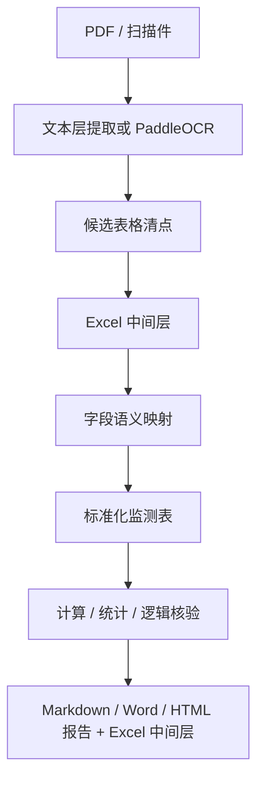

# 表格识别与 Excel 中间层设计

本文档面向业务审查、技术复核和后续开发，说明系统为什么需要“先提取成可审计 Excel 中间层，再执行字段整理与计算核验”，以及如何处理跨页、跨表、字段缺失和不同模板口径。

## 1. 当前问题复盘

现有流程可以完成多类 PDF 的自动核验，但在复杂报告上仍有三个结构性风险：

1. 表格边界风险：当前已优先按结构化表题和连续续表送入 LLM，但没有可靠标题的模板仍会回退到页面或字符块。若一个逻辑表跨页、跨多个标题或包含异常续表，仍可能漏行、重复行或把统计行当数据行。
2. 字段映射风险：不同单位的表头叫法不同，例如“本次变化量”“本期变量”“变化值”“单次变化”都可能指向 `current_change`。如果一次性让 LLM 从原文直接生成最终业务 JSON，字段映射错误不容易被业务人员发现。
3. 速度风险：让 LLM 读取整段报告文本并同时完成表格识别、字段解释、跨期拆分、单位判断和 JSON 生成，请求很大、耗时长，也更容易遇到接口截断、限流或余额错误。

因此，优化重点不是简单修改提示词，而是收窄每一步职责：先产生可以人工审查和程序复用的中间证据，再做字段语义标准化和规则核算。当前已落地 LLM 前原始候选表、LLM 后标准化表和逐字段来源映射；后续继续扩展更多本地/远程表格引擎和已知模板 fast path。

## 2. 推荐流水线



### 2.1 PDF/OCR 提取

- 优先使用 PDF 文本层，速度快且数字稳定。
- 文本层缺失、乱码或表格断裂严重时启用 PaddleOCR。
- OCR 结果必须保留原始文本、清洗后文本、缓存命中、模型名和字符压缩率，便于追溯。

### 2.2 候选表格清点

候选表格不是最终业务表，而是“PDF 中每一块看起来像表格的证据”。每个候选表建议记录：

| 字段 | 说明 |
|---|---|
| `table_id` | 稳定编号，例如 `P012-T03` |
| `page_start/page_end` | 来源页码范围 |
| `raw_title` | 表格附近标题 |
| `raw_headers` | 原始表头行 |
| `raw_rows` | 原始行列矩阵 |
| `row_count/col_count` | 原始规模 |
| `continuation_hint` | 是否疑似续表 |
| `chart_or_summary_hint` | 是否疑似图表、统计摘要或非明细表 |
| `quality_flags` | OCR 损坏、列数漂移、空列过多、重复表头等风险 |

这一步应尽量用规则和表格解析器完成。LLM 只在表头语义不明时辅助判断，不负责“凭记忆补表”。

当前文字型 PDF 使用 `pdfplumber.extract_tables()` 生成候选表，每张表保存稳定编号 `Pxxx-Txx`、引擎、物理页、页内序号、行列数、首行预览、质量标志和原始单元格矩阵。候选表提取失败只写入诊断，不阻断文本层和 OCR 主流程。

`pdfplumber` 在这里不是最终业务解析器。它负责快速读取文字层和表格几何；业务逻辑表仍需处理重复表头、宽表日期组、跨页续表和字段语义。PyMuPDF `find_tables()` 已做真实样本基准，但当前与 pdfplumber 的候选形状高度相近，暂未进入主管线。扫描件和复杂版式继续使用 PaddleOCR-VL-1.6。

### 2.3 Excel 中间层

Excel 中间层的目的不是替代最终报告，而是提供可审查的中间证据。建议工作簿包含以下 sheet：

| Sheet | 用途 |
|---|---|
| `00_报告概览` | 项目、单位、报告编号、日期、提取方式、表格数量、问题数量 |
| `01_表格清单` | 每张标准化表的类型、日期、测点数、单位、字段可靠性 |
| `02_标准化测点` | 普通位移、沉降、水位、裂缝等逐点字段 |
| `03_深层位移` | 测斜/深层位移按测孔和深度展开 |
| `04_统计摘要` | 汇总表或系统计算得到的最大值、最小值、速率 |
| `05_问题清单` | 计算、统计、逻辑问题及疑似来源 |
| `06_分析计划` | 每张表采用的计算方法、单位转换和特殊说明 |

当前 Excel 同时导出 LLM 前和 LLM 后证据：

- `00A_候选表清单`：每个物理候选表的来源和规模；
- `00B_候选表单元格`：每个原始单元格的表 ID、页、行、列和值；超过 900,000 行时自动分卷；
- `01` 至 `06`：LLM 标准化后的表格、测点、深层位移、统计、问题和分析计划。

## 3. 字段映射规则

系统统一字段如下：

| 标准字段 | 常见表头 | 可用于硬核验的条件 |
|---|---|---|
| `initial_value` | 初始值、初始高程、初始内力 | 与 `current_value` 和 `cumulative_change` 同时存在，且单位明确 |
| `previous_value` | 上次值、上期值 | 可辅助判断本次变化 |
| `current_value` | 本次值、本期值、实测值、本次高程 | 与初始值核验累计变化 |
| `current_change` | 本次变化、本期变化、单次变化 | 与速率、跨期累计连续性核验 |
| `cumulative_change` | 累计变化、累计位移、累计沉降 | 普通表最重要的核验字段 |
| `change_rate` | 速率、变化速率、mm/d | 与本次变化和监测间隔核验 |
| `previous_cumulative` | 上次累计 | 深层位移专用 |
| `current_cumulative` | 本次累计 | 深层位移专用 |
| `safety_status` | 状态、报警状态、是否超限 | 只做逻辑一致性，不单独证明计算正确 |

字段映射需要保留原始表头和标准字段的对应关系。业务审查时最关键的是确认：某列到底是“本次值”、还是“本次变化”、还是“累计变化”。三者不能混用。

## 4. 跨页与跨表处理

### 4.1 跨页续表

跨页续表不能简单按页切开后分别核验。建议合并条件：

- 监测项目相同；
- 表头字段集合高度相似；
- 页码连续；
- 测点编号或深度序列连续；
- 续页标题包含“续表”或重复标题。

合并后只保留一次表头，删除重复统计行；无法确认归属时，不合并并输出 `warning`。

### 4.2 横向多期表

有些模板会把多天数据放在一张宽表中。处理方式：

1. 识别日期列组；
2. 将每个日期列组拆成一张标准化单期表；
3. 保留 `source_table_id` 和 `source_column_group`；
4. 后续跨期连续性按日期排序核验。

不能把整个监测时间段都当作某一列组的单期间隔，否则速率会被算错。

当前来源映射实现三种宽表前缀：仅测点列、测点加一个初始值列、测点加 X/Y 两个初始坐标列。日期只取离数据行最近的日期表头，避免被更早的报告汇总日期污染；每个日期组再按“本次变化/累计变化/变化速率”或“本次变化/测值/变化速率”映射。表头在上一物理页、数据在下一页时，允许向前跨一个页界寻找表头。

所有列映射都必须同时满足表头语义和单元格数值一致。相同数值出现在多个列时，不再按值猜测；无法唯一回溯的字段进入质量提示。

### 4.3 统计表与明细表

统计表不能当明细表。若表格只有最大值、最小值、报警状态或文字结论，系统只做汇总一致性检查；没有逐点数据时不能自动证明计算正确。

## 5. 计算口径

### 5.1 普通位移/沉降/水位

当 `initial_value`、`current_value`、`cumulative_change` 同时存在：

```text
expected_cumulative = (current_value - initial_value) * unit_conversion
```

常见单位转换：

- 高程或水位原始值为 `m`，变化量为 `mm`：乘以 `1000`。
- 位移、沉降、裂缝原始变化量为 `mm`：乘以 `1`。
- 内力为 `kN`：乘以 `1`。

### 5.2 没有初始值时的首日规则

如果报告没有写明初始值，且某张表日期等于监测时间段第一天，则该日视为初始基准日：

```text
首日累计变化 = 首日本次变化
```

这条规则只适用于同一张表内同时存在 `current_change` 和 `cumulative_change` 的情况。若连累计变化也没有，不能硬核验。

### 5.3 变化速率

```text
expected_rate = current_change / interval_days
```

`interval_days` 的判断顺序：

1. 表格或报告明确写明的监测间隔；
2. 同表多数测点由 `current_change/change_rate` 反推得到的间隔；
3. 报告监测时间段仅作为兜底，不能优先用于横向多期表。

### 5.4 深层位移

```text
current_change = current_cumulative - previous_cumulative
change_rate = current_change / interval_days
```

深层位移按测孔和深度核验。不同报告方向约定不同，速率可按绝对值辅助判断，但必须在报告中说明这是方向口径风险。

### 5.5 内力类表

锚索、支撑轴力等力值表通常核验：

```text
cumulative_change = current_value - initial_value
```

如果只有当前内力和报警值，没有初始内力或变化量，只能检查是否超阈值，不能核验累计变化。

## 6. 无法自动核验的数据

以下情况必须输出“无法自动核验/需人工复核”，不能制造确定错误：

- 单一 PDF 表格只有 `current_change`，没有累计变化、初始值、上次值或速率；
- 只有统计汇总，没有逐点明细；
- 初始值列疑似阶段基准或上次值，但报告没有解释；
- 跨页表格的测点编号被 OCR 截断；
- 表格列严重错位，无法确认数字属于哪个字段；
- 图表、曲线截图或图片水印被 OCR 误识别为表格；
- LLM 分块失败，导致某些候选表没有结构化结果。

这些情况应降为 `warning` 或 `info`，并在 Excel 中间层和最终报告里标明来源。

## 7. 速度优化方案

### 7.1 缩小 LLM 任务

LLM 不应长期承担“整份 PDF 到最终业务 JSON”的全部工作。更快的方式是：

- 规则先清点候选表；
- 对每张候选表只让 LLM 做字段语义映射；
- 本地 Python 执行计算、统计和逻辑判断；
- 对已知模板建立规则 fast path。

### 7.2 并发策略

- 候选表之间可以并发映射；
- 每个请求只包含一张表或一个列组，避免一个失败拖垮整份报告；
- 并发数按服务商限流配置，DeepSeek Flash 默认可从 4 路起测，遇到限流降到 2 路；
- 结果必须按 `table_id/page/order` 回填，不能按返回先后顺序合并。

### 7.3 缓存策略

推荐缓存键：

```text
PDF_SHA256 + OCR_MODEL + CLEANER_VERSION + TABLE_HASH + LLM_MODEL + PROMPT_VERSION
```

这样同一份 PDF 只要候选表内容没变，就不会重复付费解析；提示词或模型变更时自动失效。

### 7.4 输出策略

最终报告不应只输出结论，还应输出：

- 识别了多少候选表；
- 有多少表进入标准化；
- 有多少表只作为统计/摘要；
- 有多少字段无法映射；
- 哪些表无法计算核验；
- Excel 中间层路径或下载按钮。

## 8. 开发落地顺序

1. 已落地：统一桌面端、Streamlit、CLI 的流水线和报告导出。
2. 已落地：结构化 Excel 中间层、表题/续表感知分块、并发流式 LLM 映射和结果完整性重试。
3. 已落地：LLM 前候选表清点、原始单元格 Excel、来源页/原始行/字段列映射、跨页表头和宽表日期组消歧。
4. 下一阶段：将 Docling 或 MinerU 作为可选高难文档引擎做同样的真实样本基准；通过准确率、速度、许可证和打包体积门禁后才接入。
5. 后续优化：更多已知模板 fast path、字段映射人工修正回灌。

## 9. 2026-06-21 真实样本证据

| 样本 | 物理候选表 | 原始单元格 | 候选提取 | 候选 Excel 导出 | 来源行/页 | 数值字段列映射 |
|---|---:|---:|---:|---:|---:|---:|
| 质安正确版 | 19 | 3,601 | 3.30 s | 约 3.1 s | 168/168 | 760/760 |
| 深工勘正确版 | 70 | 30,169 | 20.06 s | 2.74 s | 826/826 | 2906/2909 |
| 展誉正确版 | 142 | 37,575 | 28.71 s | 4.77 s | 223/223 | 649/649 |

深工勘剩余 3 个字段均为力值表中 LLM 生成的 `cumulative_change`，原表没有直接“累计变化”列。系统保留为无直接来源字段并输出质量提示，不强制映射为 100%。完整自动测试为 `403 passed, 3 skipped`。

工具调研结论：PaddleOCR-VL-1.6/PP-StructureV3 适合扫描和复杂版面；MinerU 官方声明支持跨页表合并；Docling 提供表格结构、统一 JSON 和 Windows 本地运行；Marker 为 GPL-3.0，不适合未经许可证评估直接打入商业 MSI。任何新增引擎都必须复用本节字段级验收口径。

官方资料：

- [PaddleOCR](https://github.com/PaddlePaddle/PaddleOCR)：VL-1.6 结构化 Markdown/JSON，PP-StructureV3 提供更细粒度坐标；
- [PyMuPDF Page.find_tables](https://pymupdf.readthedocs.io/en/latest/page.html#Page.find_tables)：本地矢量表格候选；
- [Docling](https://github.com/docling-project/docling)：表格结构、阅读顺序、统一文档对象和 Windows 本地运行；
- [MinerU](https://github.com/opendatalab/MinerU)：表格 HTML、复杂版面和跨页表合并；
- [Marker](https://github.com/datalab-to/marker)：高精度 PDF 到 Markdown/JSON，但仓库许可证为 GPL-3.0；
- [Azure Document Intelligence Layout](https://learn.microsoft.com/en-us/azure/ai-services/document-intelligence/prebuilt/layout)：可选云端表格/版面服务，需评估费用和数据出境。
